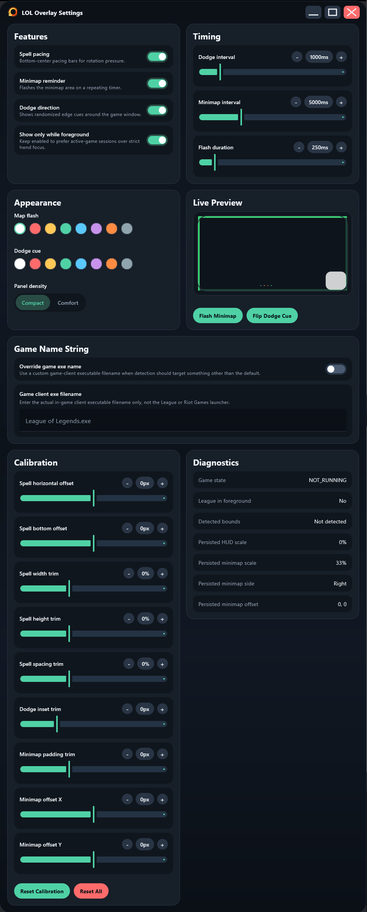

# overlay
[just give me the exe](./build/jpackage/overlay.zip)

Windows desktop overlay for League of Legends that adds simple training cues on top of the game.



## What it does

- Detects whether League is running and in the foreground
- Polls the League Live Client API on `https://localhost:2999`
- Shows a transparent always-on-top overlay with:
- spell pacing indicators
- minimap look reminders
- dodge-direction prompts

## Stack

- Kotlin
- Compose Desktop UI
- JNA
- Coroutines
- Gradle

## Requirements To Build

- Java 22

## Requirements To Run

- Windows
- League of Legends desktop client

## Run locally

```powershell
.\gradlew run
```

## Packaging

To build a runnable jar:

```powershell
.\gradlew jar
```

To build a local app image with `jpackage`:

```powershell
.\gradlew jpackageImage
```

To build the distributable zip:

```powershell
.\gradlew jpackageZip
```

## Notes

- This is a personal utility project and is tightly coupled to the current Windows and League setup.
- Overlay placement and scaling are based on local assumptions and persisted settings.
- The app is not intended as a Riot-supported or production-ready tool.
